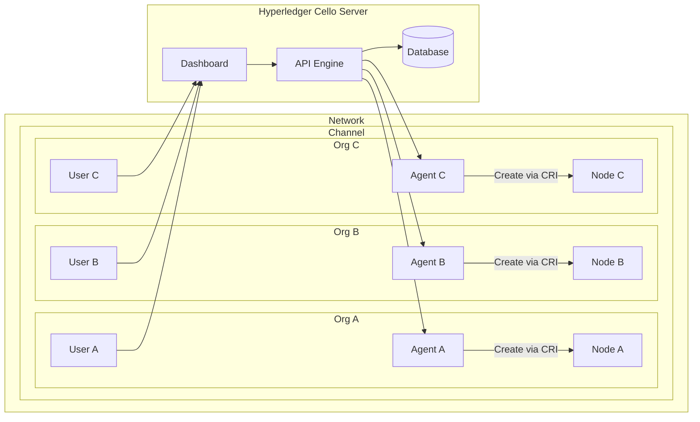

hero: All concepts related to cello

# Concepts



## Server

### Components

*Components* are all the containers you need to run a Cello Server.

#### Dashboard

The Web UI of Cello.

#### API Engine

Api engine supply the core function, all operations through the api service.

Host path mappings:

* /opt/cello/api-engine/media:/var/www/media {>>store all media files<<}
* /var/run/docker.sock:/var/run/docker.sock {>>Used for agent containers launch, which will deploy fabric, eg. network<<}
* (==optional==) $ROOT_PATH/src/api-engine:/var/www/server {>>When run in debug mode, MODE=dev, will mapping the source code into container, ROOT_PATH is the source code path.<<}

#### Database

Store all the data in a postgres database, and the storage path is mapping out on the host.

Host path mappings:

* /opt/cello/postgres:/var/lib/postgresql/data {>>Store all db data.<<}

## Agent

### Kubernetes

### Fabric Operator

<a rel="license" href="http://creativecommons.org/licenses/by/4.0/"></a><br />This work is licensed under a <a rel="license" href="http://creativecommons.org/licenses/by/4.0/">Creative Commons Attribution 4.0 International License</a>.
```
